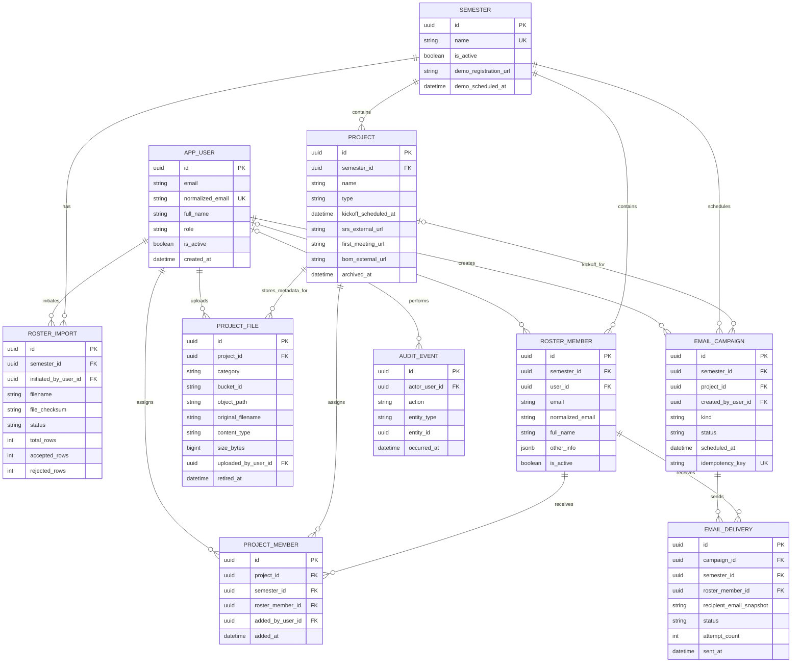

# Dept Tech Project Management — standalone data model

This is the logical model for a **separate Dept Tech web application**. It has its own Supabase project, PostgreSQL database, private Storage bucket, authentication configuration, users, and authorization rules. No NCT Hub identity, workspace, permission, audit, storage object, or email record is referenced. This document is a design, not an applied migration.

The current `SRS-Project-Management-Web-App-Expanded.md` and `Dept-Tech-Functional-Requirements-SRS.md` still describe Hub integration. Their feature workflows inform this model, but their Hub-specific architecture, routes, and permissions must be revised separately before implementation is treated as specification-complete.

## Identity and naming

- `APP_USER` is the application's user profile. It has one role, `ADMIN` or `MEMBER`; both roles authenticate against **this application's** Supabase Auth project. `APP_USER.id` matches this project's `auth.users.id`. Supabase Auth owns OTP/magic-link tokens and sessions; the application does not copy those secrets into public tables.
- Admin is a role on `APP_USER`, not a separate account table. Only a trusted bootstrap or existing admin operation can assign or change that role. A browser registration request cannot choose `ADMIN`.
- `ROSTER_MEMBER` is a person's semester-specific eligibility record, even before that person signs in. Its optional `user_id` links to an `APP_USER` after trusted email verification. One user may appear in multiple semesters.
- `PROJECT` is the original SRS's project workspace. There is no Hub tenant or `ws_id` in this application.
- Emails have two distinct purposes: Supabase Auth sends login messages; `EMAIL_CAMPAIGN` and `EMAIL_DELIVERY` record project kick-off and semester demo messages sent by the application's chosen provider.

## Complete logical ERD

Supabase Auth's `auth.users` and Storage's internal object records are platform-managed **inside this app's own Supabase project**. They are not NCT Hub entities and are intentionally omitted from the application ERD. `PROJECT_FILE` holds an opaque Storage location, not file bytes.

## Relationships and business rules

1. The application has many semesters, but at most one active semester. A semester owns its roster, projects, imports, and demo campaigns. Historical records stay available to admins.
2. `APP_USER.normalized_email` is globally unique. `(semester_id, normalized_email)` is unique for `ROSTER_MEMBER`. An imported roster record does not itself grant a login or an admin role.
3. On verified sign-in, trusted server logic matches the authenticated email to an active roster record, links `user_id`, and grants member access only if the app user is active. Admin provisioning is separate. Recheck current roster and assignment state on every protected request.
4. `PROJECT_MEMBER` joins a project to a roster member **from the same semester**. A unique `(project_id, roster_member_id)` prevents duplicate assignments. Removing an assignment immediately removes project and file access without deleting the user's account or roster history.
5. Project type is `SOFTWARE` or `HARDWARE`. Content slots are SRS, first-meeting URL, contribution template, and hardware-only BOM. SRS/BOM may be HTTPS links or uploaded files; the template is an upload. A slot must resolve to one current source.
6. A project file has a private bucket and server-generated object path. At most one non-retired upload exists for each `(project_id, category)`. Only an admin may upload or replace; assigned active members may download after authorization. Replacements retain metadata history through `retired_at`.
7. A `KICKOFF` campaign belongs to one project and targets its active assigned roster members. A `DEMO` campaign belongs to one semester, has no project, and targets its active roster. Delivery rows snapshot recipient email and have unique `(campaign_id, roster_member_id)`.
8. A worker claims due deliveries atomically, records attempts and sanitized failures, and retries only eligible failures. Idempotency prevents routine duplicate scheduling; a provider timeout still requires an explicit policy for uncertain sends.
9. `AUDIT_EVENT` records administrative changes and relevant authentication events without raw OTPs, links, cookies, credentials, or message bodies. Actor may be null for a system event.

## Entity ownership by backend folder

| Folder | Owned application entities | Responsibilities |
|---|---|---|
| `users/` | `APP_USER` | Profile, role and active state; trusted admin provisioning |
| `auth/` | No public auth-token table | This app's Supabase Auth integration, sessions and verified identity |
| `semesters/` | `SEMESTER` | Creation, activation and historical listing |
| `roster/` | `ROSTER_IMPORT`, `ROSTER_MEMBER` | CSV imports and member eligibility |
| `projects/` | `PROJECT`, `PROJECT_MEMBER` | Project data and assignments |
| `files/` | `PROJECT_FILE` | Private upload, metadata and authorized download |
| `emails/` | `EMAIL_CAMPAIGN`, `EMAIL_DELIVERY` | Scheduling, sending, status and retry |
| `audit/` | `AUDIT_EVENT` | Security-sensitive event history |

Authorization is cross-cutting: admin endpoints require an active `APP_USER` with role `ADMIN`; member project endpoints require active user, active roster entry for the active semester, and a current project assignment. Enforce this on the server and with PostgreSQL RLS or tightly controlled server-only database access.

## Mapping from the original SRS

| Original entity or behavior | Standalone model |
|---|---|
| `Semester` | `SEMESTER` |
| `DeptMember` | `ROSTER_MEMBER`, optionally linked to `APP_USER` after sign-in |
| `Workspace` | `PROJECT` |
| `WorkspaceMember` | `PROJECT_MEMBER` |
| `MagicLinkToken` and member session | This app's Supabase Auth OTP/magic-link and session records; no duplicate public token table |
| Administrator | `APP_USER.role = ADMIN` |
| File upload | Private Storage object plus `PROJECT_FILE` metadata |
| Kick-off/demo email | `EMAIL_CAMPAIGN` plus per-recipient `EMAIL_DELIVERY` |

## Decisions still needed

- Choose and configure the campaign mail provider, verified sender, and approved templates. The original SRS specifies Microsoft Graph/Outlook; the Hub-focused expansion specified AWS SES. This standalone model is provider-neutral.
- Confirm allowed CSV columns, school email domains, file formats and size limits, retention of replaced objects, historical-semester access, archive behavior, and exact scheduled send time in `Asia/Ho_Chi_Minh`.
- Confirm whether an `ADMIN` may also be assigned as a roster member. The schema permits it; authorization still follows the explicit role and assignment checks.
