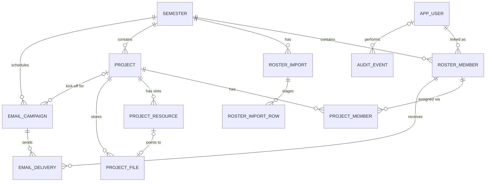

# Software Requirements Specification — Dept Tech Project Management Web App

**Revision:** 2.0 (supersedes `SRS-Project-Management-Web-App-Expanded.md` r1.1 and `Dept-Tech-Functional-Requirements-SRS.md`)
**Date:** 4 October 2026
**Architecture baseline:** Standalone Next.js + TypeScript application with its own Supabase project (Auth, PostgreSQL, private Storage)
**Status:** Draft for team review — authentication backend already implemented
**Target go-live:** before 28 October 2026

---

## 1. Introduction

### 1.1 Purpose

This SRS defines the functional requirements, architecture requirements, and corrected data model for the Dept Tech Club project management web app. It replaces the earlier documents, which disagreed with each other: the two SRS files described an NCT Hub module (`ws_id`, Hub permissions, `dept_tech_` tables), while the data model and schema described a standalone app. **This revision adopts the standalone architecture** and removes all NCT Hub dependencies (`ws_id`, Hub workspaces, Hub permissions, Hub audit, `@ncthub/*` packages).

### 1.2 Feature levels

Every functional requirement is written at three levels. Levels describe **how far the feature is built**, not who can use it.

| Level | Meaning | Commitment |
|---|---|---|
| **Simple** | Smallest correct version: core behavior, server-side validation and authorization, basic UI states. | Required for MVP. |
| **Medium** | Production-quality version: concurrency safety, audit, good UX feedback, edge cases, pagination, retries. | Required for go-live where the FR says **Target: Medium**; otherwise next iteration. |
| **Ultimo** | Further considerations: scale, automation, integrations, analytics, nice-to-have UX. | Not committed. Design must not block it. |

Each level **includes** the levels below it (Medium = Simple + Medium items).

### 1.3 Keywords

**MUST** = required at the stated level. **SHOULD** = recommended, deferrable with a recorded decision. **MAY** = optional. **TBD** = open decision listed in §9.

### 1.4 Glossary

| Term | Meaning |
|---|---|
| EBMB / Admin | Club board member with `app_users.role = 'ADMIN'` |
| Member | A person with an active roster entry in the active semester |
| App user | A row in `app_users`, linked 1:1 to this project's `auth.users` |
| Roster entry | A person's eligibility record for one semester (`roster_members`), may exist before they ever sign in |
| Project | A software or hardware project in a semester (formerly "workspace" in the original SRS) |
| Resource slot | One of the standard project materials: SRS, first-meeting link, contribution template, BOM |
| Campaign | A scheduled email send (kick-off or demo) with one delivery row per recipient |
| Eligible member | Active app user + active roster entry in the active semester |

---

## 2. Product overview

### 2.1 Problem

Project information is scattered across email, files, and links. EBMB needs one place to manage the semester roster, create projects, assign members, publish project materials, and send scheduled emails. Members need passwordless access to only the projects they are assigned to.

### 2.2 Actors

| Actor | Can do |
|---|---|
| Admin (EBMB) | Everything in the admin area: semesters, roster, projects, assignments, resources, files, campaigns, audit, user management |
| Member | Sign in, see assigned projects in the active semester, open resources, download files |
| Signed-in user without eligibility | Sign in only; sees a "no access" page — no project data |
| Visitor | Request a login code; nothing else |
| Scheduler (system) | Call the protected campaign processor with a server secret |

### 2.3 Scope

**In MVP:** passwordless auth, admin role, semesters, CSV roster import, projects (software/hardware), assignments, resource links, private files, member portal, kick-off and demo campaigns with durable delivery and retry, audit log, admin dashboard, responsive UI.

**Out of MVP:** document editing, member uploads, built-in demo booking form, editable email templates, Member Fee integration, chat/tasks/time tracking, native mobile apps, microservices, NCT Hub integration (kept only as an Ultimo consideration, AR-14).

### 2.4 Scale assumptions

Hundreds of roster members per semester, dozens of projects, a few thousand emails per semester, low concurrency except at milestones. Avoid distributed-system complexity.

---

## 3. Issues found in the previous documents and how this revision fixes them

| # | Issue | Fix in this SRS |
|---|---|---|
| I-01 | SRS files require NCT Hub (`ws_id`, Hub permissions, `dept_tech_` tables); data model/schema are standalone. | Standalone everywhere. `ws_id` and Hub permissions removed. Admin = `app_users.role`. |
| I-02 | Supabase `signInWithOtp` creates an `auth.users` row for **any** email by default, so anyone can create accounts. | FR-AUTH-01: OTP is only sent to emails that are an admin or an eligible roster entry (`shouldCreateUser` controlled server-side); the public response is identical either way. |
| I-03 | No rule for *when and how* an `app_users` row is created or linked to the roster. | FR-AUTH-03: trusted server provisioning on first verified login; roster `user_id` linked by verified normalized email. |
| I-04 | Schedule stored twice: `projects.kickoff_scheduled_at` / `semesters.demo_scheduled_at` **and** `email_campaigns.scheduled_at`. Editing one silently diverges from the other. | `email_campaigns` is the only source of truth for schedules. The two columns are removed. |
| I-05 | Resource slots are split between `projects.*_url` columns and `project_files`, with the "one source per slot" rule enforced nowhere. | New `project_resources` table: one row per `(project_id, slot)` with `source_type` = `LINK` or `FILE` and a CHECK constraint. |
| I-06 | No project name uniqueness. | `UNIQUE (semester_id, lower(name))`. |
| I-07 | Assignment removal is a hard delete; history only in audit. | `project_members.removed_at` + partial unique index on active assignments. |
| I-08 | CSV preview → commit has no staging; the file must be re-uploaded and "changed after preview" can't be detected. | `roster_import_rows` staging table; import states `PREVIEWED → COMMITTED / FAILED / EXPIRED`. |
| I-09 | Email worker crash leaves rows stuck in `SENDING` forever; no state for "provider timed out, unknown result" or "recipient no longer eligible". | Delivery lease (`claimed_at`, `lease_expires_at`), new states `UNKNOWN` and `SKIPPED`. |
| I-10 | `roster_imports.status` has no preview state and no expiry. | Statuses `PREVIEWED`, `COMMITTED`, `FAILED`, `EXPIRED`. |
| I-11 | Semester is only a boolean; can't tell a draft semester from a closed one. | `semesters.status` = `DRAFT`, `ACTIVE`, or `CLOSED`, partial unique index on `ACTIVE`. |
| I-12 | Status columns are free `text`. | Postgres enums (or CHECK constraints) for every status/type column. |
| I-13 | Email provider undecided (Graph vs SES). | Provider-neutral `EmailProvider` interface (AR-10); provider choice stays a decision (D-08). |
| I-14 | API catalog uses `/api/v1/workspaces/{wsId}/...` and `/api/admin/**` inconsistently. | One catalog: `/api/v1/admin/**`, `/api/v1/me/**`, `/api/v1/internal/**` (§6). |
| I-15 | `app_users.is_active` vs `roster_members.is_active` meaning unclear. | `app_users.is_active` = may sign in to the app at all; roster `status` = eligibility for a semester. Both required for member access. |

---

## 4. Functional requirements

### 4.0 Shared rules (apply to every FR)

- **SR-1** Every mutation is validated on the server with Zod and authorized from the server-side session. User IDs from the browser are never trusted.
- **SR-2** Admin operations require an active `app_users` row with `role = 'ADMIN'`.
- **SR-3** Member reads require: active app user + active roster entry in the **active** semester + active assignment to the project (where a project is involved). Checked on every request, not cached in the session.
- **SR-4** Each mutation returns a clear success or error result using the error envelope in §6.2.
- **SR-5** The UI shows loading, empty, validation-error, forbidden, and unexpected-error states, and disables submit while pending.
- **SR-6** All timestamps are stored as `timestamptz` (UTC) and shown in `Asia/Ho_Chi_Minh`.
- **SR-7** Security-sensitive mutations write an audit event (FR-AUD-01) in the same transaction where possible.

### 4.1 Feature inventory

| ID | Feature | Target | Notes |
|---|---|---|---|
| FR-AUTH-01 | Request login code | Medium | **Implemented** — verify against §4.2 |
| FR-AUTH-02 | Verify code and create session | Medium | **Implemented** — verify |
| FR-AUTH-03 | Account provisioning and roster linking | Medium | Check against I-02/I-03 |
| FR-AUTH-04 | Return-path redirect after login | Simple | |
| FR-AUTH-05 | Session refresh and logout | Simple | **Implemented** — verify |
| FR-AUTH-06 | Authorization guards | Medium | Used by all other FRs |
| FR-USR-01 | Admin bootstrap and role management | Simple | |
| FR-USR-02 | User list and account deactivation | Simple | |
| FR-SEM-01 | Create, edit, list semesters | Simple | |
| FR-SEM-02 | Activate and close semester | Medium | |
| FR-ROS-01 | CSV upload and validation preview | Medium | |
| FR-ROS-02 | Commit roster import | Medium | |
| FR-ROS-03 | Roster list and search | Simple | |
| FR-ROS-04 | Roster entry edit and status change | Simple | |
| FR-ROS-05 | Re-import reconciliation | Simple | Depends on D-03 |
| FR-PRJ-01 | Create and update project | Medium | |
| FR-PRJ-02 | Admin project list and detail | Simple | |
| FR-PRJ-03 | Archive project | Simple | Depends on D-06 |
| FR-ASG-01 | Assign and remove a member | Medium | |
| FR-ASG-02 | Bulk assignment | Simple | Optional for MVP |
| FR-RES-01 | Project resource slots | Medium | |
| FR-FILE-01 | Upload and replace file | Medium | |
| FR-FILE-02 | Authorized download | Medium | |
| FR-PRT-01 | Member "My projects" list | Simple | |
| FR-PRT-02 | Member project detail | Medium | |
| FR-EML-01 | Kick-off campaign | Medium | |
| FR-EML-02 | Demo campaign | Medium | |
| FR-EML-03 | Campaign processor | Medium | |
| FR-EML-04 | Delivery status, retry, cancel, resend | Medium | |
| FR-EML-05 | Email templates | Simple | |
| FR-AUD-01 | Audit log | Simple | |
| FR-DSH-01 | Admin dashboard | Simple | |

---

### 4.2 Authentication (FR-AUTH)

> Authentication is already implemented. The Simple/Medium rows below are the **acceptance checklist** to confirm the existing code matches this SRS. Items that are likely gaps are flagged ⚠.

#### FR-AUTH-01 — Request login code

Actor: Visitor. A user enters an email to receive a one-time code.

| Level | Function |
|---|---|
| Simple | Normalize email (trim, lowercase), validate syntax, call Supabase `signInWithOtp` from the server. Always return the same generic message ("If this email is registered, a code has been sent"). Never log the email body, OTP, or link. |
| Medium | ⚠ Only send an OTP when the email belongs to an active admin or an active roster entry in the active semester; otherwise return the same generic response without calling Supabase (or call with `shouldCreateUser: false`). Rate-limit per email and per IP (e.g. 5 / 15 min). Optional allowed-domain check (D-02). Audit `auth.otp_requested` with hashed email only. |
| Ultimo | Bot protection (Cloudflare Turnstile / hCaptcha). Magic-link option in addition to OTP (D-04). SSO with school Microsoft/Google account. |

**Acceptance:** Registered and unregistered emails get identical responses and timing within reason. An unregistered email never creates an `auth.users` row. The 6th request inside the window returns `429`.

#### FR-AUTH-02 — Verify code and create session

| Level | Function |
|---|---|
| Simple | Verify the OTP through Supabase `verifyOtp` on the server. On success set HTTP-only, Secure, SameSite=Lax session cookies via `@supabase/ssr`. Show clear errors for wrong / expired code. |
| Medium | Rate-limit verification attempts. Allow "resend code" with cooldown. Audit `auth.sign_in_succeeded` / `auth.sign_in_failed` without OTP values. Update `app_users.last_sign_in_at`. |
| Ultimo | Device/session list with "sign out other devices". Suspicious-login email alert. |

**Acceptance:** An OTP works once and expires per Supabase config. Cookies are not readable from JavaScript.

#### FR-AUTH-03 — Account provisioning and roster linking

After the first successful verification, the app ensures an `app_users` row and links roster entries.

| Level | Function |
|---|---|
| Simple | ⚠ On verified sign-in, a trusted server function upserts `app_users` (`id = auth.uid()`, normalized email, `full_name` from roster entry if available, `role = 'MEMBER'` by default). Then links `roster_members.user_id` for every roster row with the same normalized email and `user_id IS NULL`. The browser can never set `role`, `is_active`, or `user_id`. |
| Medium | Run provisioning in one transaction (DB function `provision_app_user()` with `SECURITY DEFINER`, or an `auth.users` insert trigger). Refuse linking if another `app_users` already owns that roster row. Audit `user.provisioned` and `roster.linked`. Inactive app user → session is created but every protected route shows "account disabled". |
| Ultimo | Handle email change in Supabase Auth (re-normalize and re-link). Merge duplicate accounts tool for admins. |

**Acceptance:** A roster member signing in for the first time is linked automatically. A user cannot become admin through any client request.

#### FR-AUTH-04 — Return-path redirect

| Level | Function |
|---|---|
| Simple | Login accepts `?next=` only if it is a relative path starting with a single `/` (reject `//`, `\`, schemes). After login, redirect to `next` or to `/projects` (member) / `/admin` (admin). |
| Medium | The target page re-checks authorization; if not allowed, show the generic "not found or no access" page (same as FR-PRT-02). |
| Ultimo | Remember last visited project per user. |

**Acceptance:** `?next=https://evil.com` and `?next=//evil.com` redirect to the default page.

#### FR-AUTH-05 — Session refresh and logout

| Level | Function |
|---|---|
| Simple | Next.js middleware refreshes the Supabase session on each request. Logout calls `signOut()` on the server and clears cookies. |
| Medium | Logout uses POST (CSRF-safe). Audit `auth.signed_out`. Protected pages are not cached (`Cache-Control: no-store`). |
| Ultimo | Admin can force-sign-out a user (revoke refresh tokens via Admin API). |

#### FR-AUTH-06 — Authorization guards

Reusable server helpers that every route uses.

| Level | Function |
|---|---|
| Simple | `requireUser()` → 401 if no session. `requireAdmin()` → 403 if not active ADMIN. `requireEligibleMember()` → active user + active roster entry in active semester. `requireProjectAccess(projectId)` → admin, or eligible member with active assignment; otherwise generic 404 for members. |
| Medium | RLS policies mirror the same rules (defense in depth, AR-04). Guards return typed context (`{ user, roster, semester }`) so handlers never re-query. Unit tests per guard and per actor (anonymous, inactive user, member of old semester, removed assignee, admin). |
| Ultimo | Fine-grained admin permissions (e.g. `ROSTER_MANAGER`, `EMAIL_MANAGER`) via a `user_permissions` table. |

---

### 4.3 User management (FR-USR)

#### FR-USR-01 — Admin bootstrap and role management

| Level | Function |
|---|---|
| Simple | First admin created by a documented seed script / SQL using the service role (never through a public endpoint). Admins can promote an existing app user to ADMIN or demote to MEMBER. An admin cannot demote themself if they are the last active admin. |
| Medium | Pre-invite admin by email before first login (`admin_invites` or `app_users` pre-created after Auth invite). Confirmation dialog. Audit `user.role_changed` with before/after. |
| Ultimo | Approval by a second admin for promotions. |

**Acceptance:** A MEMBER calling the role endpoint gets 403. The system always keeps at least one active admin.

#### FR-USR-02 — User list and account deactivation

| Level | Function |
|---|---|
| Simple | Admin lists app users (email, name, role, active, last sign-in) with search. Admin can set `is_active = false/true`. |
| Medium | Deactivation also revokes sessions (Supabase Admin API sign-out). Pagination. Audit `user.deactivated` / `user.reactivated`. |
| Ultimo | Data export / deletion request handling for a user (privacy). |

---

### 4.4 Semesters (FR-SEM)

#### FR-SEM-01 — Create, edit, list semesters

| Level | Function |
|---|---|
| Simple | Create with name (trimmed, 1–100 chars, unique case-insensitive), optional start/end date, optional demo registration URL (HTTPS). New semester has status `DRAFT`. List all semesters with status. Edit name/dates/URL. |
| Medium | Field-level errors; 409 on duplicate name. Audit create/update. Show counts (roster, projects) per semester in the list. |
| Ultimo | "Clone semester" — copy projects (without members) from a previous semester. |

#### FR-SEM-02 — Activate and close semester

| Level | Function |
|---|---|
| Simple | Activate a `DRAFT` or `CLOSED` semester: in one transaction set the current `ACTIVE` one to `CLOSED` and the target to `ACTIVE`. DB partial unique index guarantees at most one `ACTIVE`. |
| Medium | Confirmation dialog showing impact: members of the old semester lose project access (D-05 default), scheduled campaigns of the old semester stay scheduled but are flagged. Audit `semester.activated`. Handle concurrent activation (second request gets 409). |
| Ultimo | Scheduled automatic activation by date. Read-only "alumni" access to past projects (if D-05 changes). |

**Acceptance:** Two simultaneous activations leave exactly one `ACTIVE` semester. Historical data remains visible to admins.

---

### 4.5 Roster (FR-ROS)

#### FR-ROS-01 — CSV upload and validation preview

| Level | Function |
|---|---|
| Simple | Admin uploads a CSV (≤ 1 MB, `.csv`, UTF-8) for a chosen semester. Server checks required headers `Full Name`, `Email`; non-blank values; email syntax; duplicate normalized emails inside the file; existing emails in the semester (marked "update", not error). Returns totals and row-level messages. Preview does not change `roster_members`. |
| Medium | Preview is stored: a `roster_imports` row (`PREVIEWED`, file checksum, expires in 30 min) and `roster_import_rows` (row number, parsed values, status `VALID / INVALID / UPDATE / DUPLICATE`, errors). UTF-8 BOM and Excel-style quoting handled. Allowed-domain check if D-02 approved. Extra columns kept in `other_info` only if in the approved list (D-01). |
| Ultimo | Column mapping UI for differently named headers. Import from Google Sheets. Excel `.xlsx` support. |

**Acceptance:** A malformed file changes no roster rows. `Student@School.edu` and ` student@school.edu ` are the same person.

#### FR-ROS-02 — Commit roster import

| Level | Function |
|---|---|
| Simple | Admin confirms; server inserts new valid rows and updates existing ones (upsert on `(semester_id, normalized_email)`) in **one transaction**. Invalid rows are skipped and reported. Import status `COMMITTED` with counts. |
| Medium | Commit uses the stored preview (`import_id`), not a re-upload. Reject if the preview is expired or already committed (409). Sets `roster_members.last_import_id`. Newly added rows auto-link to existing app users by email (FR-AUTH-03 rule). Audit `roster.imported`. Importing the same file twice creates no duplicates. |
| Ultimo | Undo last import within N minutes. Background processing for very large files. |

**Acceptance:** Either the whole valid set commits or nothing does; the UI never reports success for a partial commit.

#### FR-ROS-03 — Roster list and search

| Level | Function |
|---|---|
| Simple | Paginated list for a semester; search by name or email; filter by status; shows linked-account indicator. |
| Medium | Sort options; shows the member's assigned projects count. Server-side pagination with total count. |
| Ultimo | Export to CSV. Saved filters. |

#### FR-ROS-04 — Roster entry edit and status change

| Level | Function |
|---|---|
| Simple | Admin can add a single entry manually, edit `full_name` and approved `other_info` fields, and set status `ACTIVE / INACTIVE`. Email is not editable (delete-and-re-add instead). |
| Medium | Deactivation dialog lists the projects the person will lose access to. Stores `deactivated_at`, `deactivated_by`, reason. Inactive entries cannot be assigned or targeted by campaigns; their pending deliveries become `SKIPPED` at send time. Audit. |
| Ultimo | Bulk status change. |

#### FR-ROS-05 — Re-import reconciliation (members missing from new file)

| Level | Function |
|---|---|
| Simple | Default: members not in the new file are left unchanged. Preview lists them as "not in file". |
| Medium | Optional checkbox "deactivate members missing from this file" — shown in preview with the count, applied in the same commit transaction, audited. |
| Ultimo | Diff view between two imports. |

---

### 4.6 Projects (FR-PRJ)

#### FR-PRJ-01 — Create and update project

| Level | Function |
|---|---|
| Simple | Admin creates a project in a semester with name (trimmed, 1–150, unique per semester case-insensitive), type `SOFTWARE / HARDWARE`, optional description. Admin can edit name/description. |
| Medium | Type change `HARDWARE → SOFTWARE` blocked while a BOM resource exists (must remove it first). Cannot create projects in a `CLOSED` semester. Optimistic concurrency via `updated_at` (409 on stale edit). Audit create/update with changed fields. Editing a project never creates or resends a campaign. |
| Ultimo | Project tags, lead member, status (planning/active/done), cover image. |

**Acceptance:** Duplicate names in the same semester are rejected; same name in another semester is allowed.

#### FR-PRJ-02 — Admin project list and detail

| Level | Function |
|---|---|
| Simple | List projects of a selected semester (default: active) with type, member count, resource completeness. Detail page shows info, resources, members, kick-off campaign status. |
| Medium | Filter by type, search by name, include/exclude archived. No N+1 queries (single query with aggregates/view). |
| Ultimo | Kanban/overview cards, progress indicators. |

#### FR-PRJ-03 — Archive project

| Level | Function |
|---|---|
| Simple | Archive sets `archived_at`; no hard delete. Archived projects are hidden from members and cannot get new assignments or campaigns. Unarchive is allowed. |
| Medium | Archiving with a `SCHEDULED` kick-off campaign requires choosing "cancel campaign" in the confirmation dialog. Audit. |
| Ultimo | Hard delete after retention period (D-11) with file cleanup. |

---

### 4.7 Assignments (FR-ASG)

#### FR-ASG-01 — Assign and remove a member

| Level | Function |
|---|---|
| Simple | Admin picks from the **same semester's active roster** (no free-form email). Creates `project_members` row. Remove sets `removed_at` / `removed_by`. Duplicate active assignment rejected (409). |
| Medium | DB-level guarantees: composite FK on `(roster_member_id, semester_id)` and `(project_id, semester_id)`; partial unique index `(project_id, roster_member_id) WHERE removed_at IS NULL`. Removal takes effect on the next request (no cached access). Re-assigning a removed member creates a new row (history kept). Audit add/remove. |
| Ultimo | Member role inside a project (lead / member). Notify member by email on assignment. |

**Acceptance:** Inactive, cross-semester, or duplicate assignments fail. A removed member immediately gets the generic denial page and cannot obtain a new signed download URL.

#### FR-ASG-02 — Bulk assignment

| Level | Function |
|---|---|
| Simple | Multi-select roster members and assign in one request; each checked as in FR-ASG-01; response lists accepted and rejected with reasons. |
| Medium | Single transaction per request; one audit event with the list. |
| Ultimo | Assign from CSV (project name, email). Auto-balance members across projects. |

---

### 4.8 Resources and files (FR-RES, FR-FILE)

Resource slots and their allowed sources:

| Slot | Allowed source | Project type |
|---|---|---|
| `SRS` | LINK or FILE | Both |
| `FIRST_MEETING` | LINK only | Both |
| `CONTRIBUTION_TEMPLATE` | FILE only (LINK allowed at Medium if D-07 approves) | Both |
| `BOM` | LINK or FILE | HARDWARE only |

#### FR-RES-01 — Project resource slots

| Level | Function |
|---|---|
| Simple | Admin sets/clears each slot. LINK must be a valid `https://` URL. Each slot resolves to exactly one current source (`project_resources` row with CHECK). BOM rejected for software projects. |
| Medium | Switching a slot from FILE to LINK retires the old file (FR-FILE-01 retention). Audit `resource.updated`. Optional link label. |
| Ultimo | Link previews (title/favicon), link health check, extra custom slots. |

**Acceptance:** A software project can never have a BOM row. A slot never has both a link and a file active.

#### FR-FILE-01 — Upload and replace file

| Level | Function |
|---|---|
| Simple | Admin uploads for a FILE-capable slot. Server validates extension, detected MIME (magic bytes), size (default 10 MB, D-07), and slot. Object path generated by the server: `projects/{projectId}/{slot}/{uuid}.{ext}` in a **private** bucket. Metadata in `project_files`; the slot points to it. Original filename stored for display only. |
| Medium | Two-phase write: insert `project_files` as `UPLOADING` → upload object → in one transaction mark `ACTIVE`, retire previous file (`retired_at`), update `project_resources`. A cleanup job removes orphaned `UPLOADING` rows/objects older than 1 hour. Checksum (SHA-256) stored. Progress indicator in UI. Audit `file.uploaded` / `file.replaced`. |
| Ultimo | Malware scanning (D-07). Version history UI with restore. Direct-to-storage signed upload URLs for large files. |

#### FR-FILE-02 — Authorized download

| Level | Function |
|---|---|
| Simple | `requireProjectAccess(projectId)` then verify the file belongs to that project and is the active file → create a Supabase signed URL valid ≤ 5 minutes. Unknown or unauthorized → same generic response for members. |
| Medium | Download served with `Content-Disposition: attachment; filename=<original>`. Rate-limit signed URL creation. Never cache signed URLs client-side. |
| Ultimo | Inline PDF preview. Download analytics per project. |

**Acceptance:** Guessing a `fileId` from another project never yields a URL. Retired files cannot be downloaded by members.

---

### 4.9 Member portal (FR-PRT)

#### FR-PRT-01 — "My projects" list

| Level | Function |
|---|---|
| Simple | Eligible member sees non-archived projects of the active semester with an active assignment: name, type. Empty state: "You have no assigned projects yet — contact EBMB." Non-eligible signed-in user sees a "no access" page. |
| Medium | Shows which resources are available; mobile-first layout. Single query. |
| Ultimo | Past semesters section (if D-05 allows), notifications badge. |

#### FR-PRT-02 — Member project detail

| Level | Function |
|---|---|
| Simple | Shows name, type, description, SRS, first-meeting link, contribution template download, BOM (hardware only). Absent slots are hidden, never broken links. External links open in a new tab with `rel="noopener noreferrer"`. |
| Medium | Unknown project ID and unauthorized project ID return **the same** generic response (D-09: 404). Teammate names visible (D-10). Works at 360 px width. |
| Ultimo | Project announcements, milestones, contribution submission. |

**Acceptance:** Changing the project ID in the URL never reveals another project's metadata or files.

---

### 4.10 Email campaigns (FR-EML)

Campaign states: `DRAFT → SCHEDULED → PROCESSING → COMPLETED | COMPLETED_WITH_FAILURES`, and `CANCELLED` from `DRAFT/SCHEDULED`.
Delivery states: `PENDING → SENDING → SENT | FAILED_RETRYABLE | FAILED_PERMANENT | UNKNOWN | SKIPPED`.

#### FR-EML-01 — Kick-off campaign

| Level | Function |
|---|---|
| Simple | Admin schedules a kick-off for a project at a future date/time (date-only input → 09:00 `Asia/Ho_Chi_Minh`, D-12). One active (non-cancelled, not completed) kick-off campaign per project. Recipients resolved **at processing time** = active roster members with active assignment. Email contains project name, fixed text, and the link `/{APP_URL}/projects/{projectId}`. |
| Medium | Reschedule allowed only while `SCHEDULED`. UI shows local time, estimated recipient count, template preview. Confirmation dialog. Audit `campaign.scheduled` / `campaign.rescheduled`. |
| Ultimo | Auto-create kick-off when a project is created with a default offset. Calendar invite (.ics) attachment. |

#### FR-EML-02 — Demo campaign

| Level | Function |
|---|---|
| Simple | Admin schedules a semester-wide demo email; requires the semester's demo registration URL. Recipients at processing time = all active roster members in that semester. |
| Medium | Same scheduling/reschedule/audit behavior as FR-EML-01. Show estimated recipients. |
| Ultimo | Targeting subsets (e.g. only hardware members). Reminder campaign N days later to members who didn't register (needs form integration). |

#### FR-EML-03 — Campaign processor

| Level | Function |
|---|---|
| Simple | Protected endpoint `POST /api/v1/internal/campaigns/process` (secret header, constant-time compare). For each due `SCHEDULED` campaign: set `PROCESSING`, create delivery rows (unique `(campaign_id, roster_member_id)`), send each via `EmailProvider`, record result. Called every minute by the scheduler (D-13). State is fully in PostgreSQL, so restarts lose nothing. |
| Medium | Atomic claim via DB function using `SELECT … FOR UPDATE SKIP LOCKED` that sets `SENDING`, `claimed_at`, `lease_expires_at` (e.g. +5 min). Expired leases are reclaimed. Provider idempotency key = delivery ID. Timeout/unknown result → `UNKNOWN` (not auto-resent). Transient errors → `FAILED_RETRYABLE` with exponential backoff (`next_attempt_at`), max 3 attempts → `FAILED_PERMANENT`. Recipient no longer eligible at send time → `SKIPPED`. Batch size limit per invocation to stay inside serverless time limits. Campaign finalized to `COMPLETED` or `COMPLETED_WITH_FAILURES`. |
| Ultimo | Provider webhooks (bounce/complaint) update delivery status. Dedicated queue/worker if volume grows. Suppression list for bounced addresses. |

**Acceptance:** Two overlapping processor calls never send the same delivery twice. A `SENT` delivery is never re-sent by retry.

#### FR-EML-04 — Delivery status, retry, cancel, resend

| Level | Function |
|---|---|
| Simple | Campaign list with status and counts per delivery status. Campaign detail with per-recipient table (email snapshot, status, attempts, last attempt, sent at, sanitized error). "Retry failed" requeues only `FAILED_*` rows. Cancel allowed only in `DRAFT/SCHEDULED`. |
| Medium | Pagination/search in recipient table. `UNKNOWN` rows shown separately with "mark sent" / "retry" operator choice. "Resend to everyone" creates a **new** campaign with `parent_campaign_id` — never mutates the old one. All actions confirmed and audited. |
| Ultimo | Send-test-to-myself. Export delivery report. Open/click tracking (privacy review required). |

#### FR-EML-05 — Email templates

| Level | Function |
|---|---|
| Simple | Two fixed templates in code (`kickoff`, `demo`) built with React Email, with `template_key` and `template_version` stored on the campaign. Plain-text alternative included. |
| Medium | Bilingual (EN/VI) content. Preview route for admins. Template snapshot of rendered subject stored on campaign. |
| Ultimo | Admin-editable templates with version history and approval. |

---

### 4.11 Audit and dashboard (FR-AUD, FR-DSH)

#### FR-AUD-01 — Audit log

| Level | Function |
|---|---|
| Simple | `audit_events` row for: sign-in success/failure, role/active changes, semester create/activate, roster import/status change, project create/update/archive, assignment add/remove, resource/file change, campaign schedule/cancel/retry/resend. Fields: actor, action, entity type/id, metadata (allowlisted), request ID, time. Never OTPs, tokens, cookies, signed URLs, keys, email bodies. |
| Medium | Admin audit page with filters (actor, action, entity, date) and pagination. Audit insert in the same transaction as the change. Table is append-only (no UPDATE/DELETE grants). |
| Ultimo | Before/after diffs, export, retention policy job (D-11). |

#### FR-DSH-01 — Admin dashboard

| Level | Function |
|---|---|
| Simple | Active semester name, roster count (active), project count by type, upcoming campaigns, failed deliveries count — each linking to its page. Empty state when no semester is active. |
| Medium | Warnings: projects with no members, projects missing required resources, campaigns with failures, imports expired unused. |
| Ultimo | Charts across semesters, member engagement metrics. |

---

## 5. Architecture requirements (AR)

### 5.1 Overview

```text
Browser (React, Tailwind, shadcn/ui)
   │  HTTPS + Supabase session cookies
   ▼
Next.js App Router (TypeScript, Node runtime)
   ├─ Server Components  → reads through services
   ├─ Server Actions     → form mutations through services
   ├─ Route Handlers /api/v1/** → JSON API, uploads, internal processor
   └─ middleware.ts      → session refresh, route protection
          │
          ▼
   server/modules/<domain>   (service → repository → Supabase)
          │
   ┌──────┼──────────────┬───────────────────┐
   ▼      ▼              ▼                   ▼
Supabase Auth  Supabase Postgres (RLS)  Supabase Storage (private)  EmailProvider (SES/…)
                         ▲
                 pg_cron / external cron → POST /api/v1/internal/campaigns/process
```

### 5.2 Requirements

| ID | Area | Simple | Medium | Ultimo |
|---|---|---|---|---|
| AR-01 | Stack | Next.js App Router, strict TypeScript, Supabase (`@supabase/ssr`, `@supabase/supabase-js`), Zod, Tailwind + shadcn/ui, React Email. One package manager, pinned in `package.json`. | Generated DB types (`supabase gen types`) committed and checked in CI. | Monorepo split (`apps/web`, `packages/db`, `packages/emails`) if a second app appears. |
| AR-02 | Code structure | Feature modules under `src/server/modules/{auth,users,semesters,roster,projects,resources,files,emails,audit}` each with `schema.ts` (Zod), `service.ts` (business rules), `repository.ts` (DB access), `policy.ts` (authorization). Routes/actions are thin: parse → guard → service → respond. `server-only` import in all server modules. | No route queries Supabase directly; ESLint rule / import boundaries enforce it. Shared `lib/` for errors, http, logger, time, env. | Domain events (e.g. `project.member_added`) for notifications/integrations. |
| AR-03 | Authentication | Supabase Auth email OTP, cookie sessions through `@supabase/ssr`, middleware refresh, server-side `getUser()` (never trust `getSession()` alone for authorization). | Rate limiting, OTP gating (FR-AUTH-01), provisioning function (FR-AUTH-03). | SSO, MFA for admins. |
| AR-04 | Authorization | Guards in FR-AUTH-06 on every handler/action. RLS **enabled** on every public table; default deny. | RLS policies mirror guards using helper SQL functions `is_admin()`, `is_eligible_member()`, `can_access_project(project_id)`. Policy tests for each actor. Service-role key only in the processor and provisioning paths. | Permission table for granular admin roles. |
| AR-05 | Database & migrations | Supabase SQL migrations in `supabase/migrations`, applied with Supabase CLI. Enums, FKs, CHECKs, unique and partial indexes as in §7. `updated_at` trigger. | Migrations tested via `supabase db reset` in CI; seed script for local data; multi-step writes in Postgres functions (RPC) for atomicity (activate semester, commit import, claim deliveries, replace file). | Read replicas / partitioning of `email_deliveries` and `audit_events` if needed. |
| AR-06 | Validation & errors | Zod schemas shared between form and server. Single error envelope (§6.2) and error classes mapped to HTTP codes. | Field errors mapped to form fields; `requestId` on every response and log line. | i18n of error messages. |
| AR-07 | API | REST under `/api/v1` (§6); Server Actions allowed for UI forms. JSON, UUIDs, ISO 8601, `page`/`size` pagination. | Typed client helper; API examples / Postman collection versioned in repo. | OpenAPI generated from Zod (`zod-to-openapi`). |
| AR-08 | File storage | Private bucket `project-files`; server-generated paths; signed URLs ≤ 5 min; size/MIME validation. | Two-phase upload + orphan cleanup job; Storage policies deny all direct client access. | Malware scanning, CDN for large files. |
| AR-09 | Background jobs | Durable campaign + delivery tables; protected processor route; scheduler every minute (`pg_cron` + `pg_net`, or Vercel Cron — D-13). | `SKIP LOCKED` claims, leases, backoff, batch limit, idempotent re-entry. | Dedicated worker/queue (e.g. Supabase Edge Function or BullMQ) when volume or time limits require. |
| AR-10 | Email | `EmailProvider` interface `{ send(message, idempotencyKey) → { providerMessageId } }` with one implementation (default AWS SES, D-08) and a console/fake provider for local dev. Auth OTP mail stays with Supabase Auth (custom SMTP). | Error classification (transient / permanent / unknown); verified sender domain (SPF, DKIM, DMARC). | Webhooks for bounces; second provider failover. |
| AR-11 | Security | HTTPS, secrets only in env, service-role key never in `NEXT_PUBLIC_*`, parameterized queries only, safe redirects, `rel="noopener"` on external links. | Security headers (CSP, `X-Content-Type-Options`, `frame-ancestors 'none'`, HSTS), CSRF-safe mutations (Server Actions / POST + SameSite), rate limiting (Upstash Redis or DB table), log redaction, dependency scanning in CI. | Pen test before second year of use; WAF. |
| AR-12 | Observability | Structured JSON logs with `requestId`, no secrets/PII beyond IDs. `/api/health` liveness. | Error tracking (Sentry), readiness check (DB reachable), alert on campaign `COMPLETED_WITH_FAILURES` and processor errors. | Dashboards, uptime monitoring, SLOs. |
| AR-13 | Testing & CI | Vitest unit tests for services, validation, normalization, guards. CI: install, lint, type-check, test, build. | Integration tests against local Supabase (RLS, concurrency of claims, import transaction). Playwright E2E for login → project access, denied access, import, assign, retry. | Load test of campaign processor; visual regression. |
| AR-14 | Deployment & environments | Local (Supabase CLI + Inbucket + fake email), Production (e.g. Vercel + Supabase cloud). Env vars documented in `.env.example`. | Staging environment with its own Supabase project; migrations applied by CI before deploy; backups enabled and restore tested. | NCT Hub migration path: keep auth/DB access behind modules so the app can later be moved into the Hub monorepo with an ID-mapping migration. |
| AR-15 | UI/UX & accessibility | Responsive (≥ 360 px), loading/empty/error states, confirmation for destructive actions, disabled submit while pending. | WCAG 2.1 AA: labels, focus, contrast, keyboard navigation; EN/VI with `next-intl`. | Dark mode, PWA install. |
| AR-16 | Performance | Indexed queries, paginated lists. | p95 < 500 ms for normal JSON requests; no N+1 (views/RPC for lists with counts). | Caching of read-heavy admin lists with tag revalidation. |

### 5.3 Proposed folder structure

```text
src/
  app/
    (public)/login/                  # OTP request + verify
    (member)/projects/               # My projects, project detail
    (admin)/admin/
      page.tsx                       # dashboard
      semesters/ roster/ projects/ campaigns/ users/ audit/
    api/
      health/route.ts
      v1/admin/**/route.ts
      v1/me/**/route.ts
      v1/internal/campaigns/process/route.ts
    middleware.ts
  server/
    modules/
      auth/ users/ semesters/ roster/ projects/ resources/ files/ emails/ audit/
        schema.ts service.ts repository.ts policy.ts
    lib/
      supabase/{server.ts, admin.ts}   # admin.ts = service role, server-only
      errors.ts http.ts logger.ts env.ts time.ts rate-limit.ts
    email/
      provider.ts ses-provider.ts fake-provider.ts
      templates/{kickoff.tsx, demo.tsx}
  components/ (ui, forms, tables)
supabase/
  migrations/  seed.sql  tests/ (RLS tests)
```

---

## 6. API specification

### 6.1 Endpoint catalog

Server Actions may replace the admin mutation endpoints for UI forms; the HTTP routes below are the contract for anything consumed outside the form (tests, Postman, scripts).

**Member (`requireEligibleMember`)**

| Method | Path | Purpose |
|---|---|---|
| GET | `/api/v1/me` | Current user, role, eligibility |
| GET | `/api/v1/me/projects` | My projects (FR-PRT-01) |
| GET | `/api/v1/me/projects/{projectId}` | Project detail (FR-PRT-02) |
| POST | `/api/v1/me/projects/{projectId}/files/{fileId}/download-url` | Signed URL (FR-FILE-02) |

**Admin (`requireAdmin`)**

| Method | Path | Purpose |
|---|---|---|
| GET/PATCH | `/api/v1/admin/users`, `/api/v1/admin/users/{userId}` | List users, change role/active |
| GET/POST | `/api/v1/admin/semesters` | List / create |
| PATCH | `/api/v1/admin/semesters/{semesterId}` | Edit |
| POST | `/api/v1/admin/semesters/{semesterId}/activate` | Activate |
| POST | `/api/v1/admin/semesters/{semesterId}/roster/imports` | Upload CSV → preview (`PREVIEWED`) |
| GET | `/api/v1/admin/roster/imports/{importId}` | Preview / result |
| POST | `/api/v1/admin/roster/imports/{importId}/commit` | Commit import |
| GET/POST | `/api/v1/admin/semesters/{semesterId}/roster` | List/search, add single entry |
| PATCH | `/api/v1/admin/roster/{rosterMemberId}` | Edit / status |
| GET/POST | `/api/v1/admin/projects` | List (filter `semesterId`) / create |
| GET/PATCH | `/api/v1/admin/projects/{projectId}` | Detail / update |
| POST | `/api/v1/admin/projects/{projectId}/archive`, `/unarchive` | Archive state |
| POST | `/api/v1/admin/projects/{projectId}/members` | Assign one or many |
| DELETE | `/api/v1/admin/projects/{projectId}/members/{rosterMemberId}` | Remove assignment |
| PUT/DELETE | `/api/v1/admin/projects/{projectId}/resources/{slot}` | Set link / clear slot |
| POST | `/api/v1/admin/projects/{projectId}/resources/{slot}/file` | Upload file (multipart) |
| POST | `/api/v1/admin/projects/{projectId}/files/{fileId}/download-url` | Admin download |
| POST | `/api/v1/admin/projects/{projectId}/kickoff-campaign` | Schedule kick-off |
| POST | `/api/v1/admin/semesters/{semesterId}/demo-campaign` | Schedule demo |
| GET | `/api/v1/admin/campaigns`, `/api/v1/admin/campaigns/{campaignId}` | List / detail + deliveries |
| PATCH | `/api/v1/admin/campaigns/{campaignId}` | Reschedule (only `SCHEDULED`) |
| POST | `/api/v1/admin/campaigns/{campaignId}/retry-failures` \| `/cancel` \| `/resend` | Operations |
| GET | `/api/v1/admin/audit-events` | Audit log |
| GET | `/api/v1/admin/dashboard` | Dashboard counts |

**Internal (secret header)**

| Method | Path | Purpose |
|---|---|---|
| POST | `/api/v1/internal/campaigns/process` | Process due campaigns/deliveries |
| POST | `/api/v1/internal/files/cleanup` | Remove orphaned uploads / expired previews |

### 6.2 Error envelope and status codes

```json
{
  "status": 400,
  "code": "VALIDATION_ERROR",
  "message": "The request contains invalid fields.",
  "fieldErrors": [{ "field": "email", "message": "Email is invalid." }],
  "requestId": "6f363e3e-5b63-4aec-9be0-36a14a2f3989",
  "timestamp": "2026-10-04T03:15:30Z"
}
```

| Code | Use |
|---|---|
| 200 / 201 / 204 | OK / created / no content |
| 400 | Validation error |
| 401 | No or invalid session |
| 403 | Signed in but not admin / not eligible (admin area, member area as a whole) |
| 404 | Missing resource; **also** unauthorized project/file for members (no existence leak) |
| 409 | Uniqueness or state conflict (duplicate name, already active, stale edit, campaign not cancellable) |
| 413 / 415 | Upload too large / unsupported type |
| 429 | Rate limited |
| 500 | Unexpected error (no internals leaked) |

---

## 7. Revised data model

### 7.1 ERD



### 7.2 Enums

| Enum | Values |
|---|---|
| `user_role` | `ADMIN`, `MEMBER` |
| `semester_status` | `DRAFT`, `ACTIVE`, `CLOSED` |
| `roster_status` | `ACTIVE`, `INACTIVE` |
| `import_status` | `PREVIEWED`, `COMMITTED`, `FAILED`, `EXPIRED` |
| `import_row_status` | `VALID`, `UPDATE`, `INVALID`, `DUPLICATE` |
| `project_type` | `SOFTWARE`, `HARDWARE` |
| `resource_slot` | `SRS`, `FIRST_MEETING`, `CONTRIBUTION_TEMPLATE`, `BOM` |
| `resource_source` | `LINK`, `FILE` |
| `file_status` | `UPLOADING`, `ACTIVE`, `RETIRED` |
| `campaign_kind` | `KICKOFF`, `DEMO` |
| `campaign_status` | `DRAFT`, `SCHEDULED`, `PROCESSING`, `COMPLETED`, `COMPLETED_WITH_FAILURES`, `CANCELLED` |
| `delivery_status` | `PENDING`, `SENDING`, `SENT`, `FAILED_RETRYABLE`, `FAILED_PERMANENT`, `UNKNOWN`, `SKIPPED` |

### 7.3 Tables (12)

All tables: `id uuid PK default gen_random_uuid()`, `created_at timestamptz not null default now()`, and `updated_at` (trigger) where rows are edited. RLS enabled on all.

**`app_users`** (exists — check against this)
`id` (PK, FK `auth.users(id)` ON DELETE RESTRICT), `email`, `normalized_email` UNIQUE, `full_name`, `role user_role default 'MEMBER'`, `is_active bool default true`, `last_sign_in_at`.
Rules: `role`/`is_active` writable only by admin paths or service role (column-level grant or trigger).

**`semesters`**
`name varchar(100)`, `status semester_status default 'DRAFT'`, `starts_on date`, `ends_on date`, `demo_registration_url text` (CHECK `^https://`).
Indexes: UNIQUE `lower(trim(name))`; UNIQUE `(status) WHERE status = 'ACTIVE'`. *Removed:* `is_active`, `demo_scheduled_at`.

**`roster_imports`**
`semester_id` FK, `initiated_by` FK app_users, `filename`, `file_checksum`, `status import_status`, `total_rows`, `valid_rows`, `invalid_rows`, `update_rows`, `deactivate_missing bool default false`, `expires_at`, `committed_at`, `error_summary jsonb`.
CHECK counts ≥ 0. Index `(semester_id, created_at desc)`.

**`roster_import_rows`** (new)
`import_id` FK ON DELETE CASCADE, `row_number int`, `full_name`, `email`, `normalized_email`, `other_info jsonb`, `status import_row_status`, `errors jsonb`.
UNIQUE `(import_id, row_number)`. Purged after commit + 30 days.

**`roster_members`**
`semester_id` FK, `user_id` FK app_users NULL, `email`, `normalized_email`, `full_name`, `other_info jsonb default '{}'`, `status roster_status default 'ACTIVE'`, `deactivated_at`, `deactivated_by`, `last_import_id` FK roster_imports NULL.
UNIQUE `(semester_id, normalized_email)`; UNIQUE `(semester_id, user_id) WHERE user_id IS NOT NULL`; UNIQUE `(id, semester_id)` (composite FK target); index `(user_id, semester_id)`.

**`projects`**
`semester_id` FK, `name varchar(150)`, `description text`, `type project_type`, `archived_at`, `created_by` FK app_users.
UNIQUE `(semester_id, lower(name))`; UNIQUE `(id, semester_id)`; index `(semester_id, archived_at)`. *Removed:* `kickoff_scheduled_at`, `srs_external_url`, `first_meeting_url`, `bom_external_url` (→ `project_resources`, `email_campaigns`).

**`project_members`**
`project_id`, `roster_member_id`, `semester_id`; composite FKs `(project_id, semester_id) → projects(id, semester_id)` and `(roster_member_id, semester_id) → roster_members(id, semester_id)`; `added_by`, `added_at`, `removed_at`, `removed_by`.
UNIQUE `(project_id, roster_member_id) WHERE removed_at IS NULL`; index `(roster_member_id) WHERE removed_at IS NULL`. Trigger: reject insert if roster status ≠ `ACTIVE` or project archived.

**`project_files`**
`project_id` FK, `slot resource_slot`, `bucket_id`, `object_path`, `original_filename`, `content_type`, `size_bytes bigint CHECK > 0`, `checksum_sha256`, `status file_status default 'UPLOADING'`, `uploaded_by`, `retired_at`.
UNIQUE `(bucket_id, object_path)`; UNIQUE `(project_id, slot) WHERE status = 'ACTIVE'`; index `(status, created_at)` for cleanup.

**`project_resources`** (new)
`project_id` FK, `slot resource_slot`, `source_type resource_source`, `url text`, `file_id` FK project_files NULL, `label`, `updated_by`.
UNIQUE `(project_id, slot)`.
CHECK `(source_type = 'LINK' AND url ~ '^https://' AND file_id IS NULL) OR (source_type = 'FILE' AND file_id IS NOT NULL AND url IS NULL)`.
CHECK `slot <> 'FIRST_MEETING' OR source_type = 'LINK'`; CHECK `slot <> 'CONTRIBUTION_TEMPLATE' OR source_type = 'FILE'` (relax if D-07).
Trigger: `slot = 'BOM'` only when project type is `HARDWARE`; `file_id` must belong to the same project and slot.

**`email_campaigns`**
`semester_id` FK, `project_id` NULL, `kind campaign_kind`, `status campaign_status`, `scheduled_at`, `template_key`, `template_version int`, `subject_snapshot`, `parent_campaign_id` FK self NULL, `idempotency_key` UNIQUE, `created_by`, `started_at`, `completed_at`, `cancelled_at`, `cancelled_by`.
CHECK `(kind='KICKOFF' AND project_id IS NOT NULL) OR (kind='DEMO' AND project_id IS NULL)`; composite FK `(project_id, semester_id) → projects(id, semester_id)`; UNIQUE `(id, semester_id)`; UNIQUE `(project_id) WHERE kind='KICKOFF' AND status IN ('DRAFT','SCHEDULED','PROCESSING')`; UNIQUE `(semester_id) WHERE kind='DEMO' AND status IN ('DRAFT','SCHEDULED','PROCESSING')`; index `(status, scheduled_at)`.

**`email_deliveries`**
`campaign_id`, `semester_id` (composite FK to campaign), `roster_member_id` (composite FK to roster), `recipient_email_snapshot`, `status delivery_status default 'PENDING'`, `attempt_count int default 0`, `claimed_at`, `lease_expires_at`, `last_attempt_at`, `next_attempt_at`, `sent_at`, `provider_message_id`, `last_error_code`, `last_error_summary`.
UNIQUE `(campaign_id, roster_member_id)`; index `(status, next_attempt_at)`; index `(status, lease_expires_at) WHERE status = 'SENDING'`.

**`audit_events`**
`actor_user_id` NULL, `action`, `entity_type`, `entity_id` NULL, `semester_id` NULL, `metadata jsonb default '{}'`, `request_id`, `occurred_at`.
Index `(occurred_at desc)`, `(actor_user_id, occurred_at desc)`, `(entity_type, entity_id)`. Insert-only.

### 7.4 Database functions (RPC)

| Function | Purpose | Called by |
|---|---|---|
| `provision_app_user()` | Upsert app user + link roster rows for `auth.uid()` | FR-AUTH-03 |
| `is_admin()`, `is_eligible_member()`, `can_access_project(uuid)` | RLS helpers (`SECURITY DEFINER`, `STABLE`) | AR-04 |
| `activate_semester(uuid)` | Close current, activate target, audit | FR-SEM-02 |
| `commit_roster_import(uuid, bool)` | Apply staged rows, optional deactivate-missing, audit | FR-ROS-02/05 |
| `finalize_file_upload(uuid)` | Activate file, retire old, point resource | FR-FILE-01 |
| `claim_due_deliveries(int)` | `FOR UPDATE SKIP LOCKED` claim with lease | FR-EML-03 |
| `materialize_campaign(uuid)` | Resolve recipients, insert delivery rows | FR-EML-03 |

### 7.5 Migration from the current schema

1. Keep `app_users` (already used by auth); add `last_sign_in_at`, convert `role` to enum, add the protection trigger/grants.
2. Create enums, then tables in order: `semesters`, `roster_imports`, `roster_import_rows`, `roster_members`, `projects`, `project_members`, `project_files`, `project_resources`, `email_campaigns`, `email_deliveries`, `audit_events`.
3. If any earlier version of these tables was already applied, migrate: `semesters.is_active → status`, `projects.*_url → project_resources` rows, `kickoff_scheduled_at/demo_scheduled_at → email_campaigns (SCHEDULED)`, then drop the old columns.
4. Add RLS helper functions, policies, Storage bucket + policies, then regenerate TypeScript types.

---

## 8. Non-functional requirements (summary)

| Area | Requirement |
|---|---|
| Security | See AR-11. No raw tokens/OTPs/cookies/signed URLs in logs or audit. Roster data visible only to admins. |
| Reliability | Multi-record changes are transactional (RPC). Campaign work survives restart. Retries are idempotent. |
| Performance | p95 < 500 ms for normal requests; lists paginated; campaigns asynchronous. |
| Availability | Supabase automated backups; documented restore; RPO/RTO agreed before go-live (D-14). |
| Privacy | Collect only Full Name + Email + approved extras. Retention for old semesters, imports, audit, files defined (D-11). |
| Usability | Mobile-friendly member pages; EN/VI; WCAG 2.1 AA target. |
| Maintainability | Module boundaries (AR-02), lint + type-check + tests in CI, `.env.example` documented. |

---

## 9. Decisions required

| ID | Decision | Planning default | Affects |
|---|---|---|---|
| D-01 | Extra CSV columns kept in `other_info` | None besides `Full Name`, `Email` (+ optional `Student ID`) | FR-ROS-01 |
| D-02 | Allowed school email domain(s) | No restriction until confirmed | FR-AUTH-01, FR-ROS-01 |
| D-03 | Members missing from re-import | Leave unchanged; optional deactivate checkbox | FR-ROS-05 |
| D-04 | OTP code only, or also magic link | OTP only | FR-AUTH-01/02 |
| D-05 | Access to projects of closed semesters | No member access | FR-SEM-02, FR-PRT |
| D-06 | Archive/delete rules | Archive only, no hard delete | FR-PRJ-03 |
| D-07 | File types, size limits, malware scan, retention of replaced files | PDF/DOCX for SRS, XLSX/PDF for template & BOM, 10 MB, keep retired 90 days | FR-FILE-01, FR-RES-01 |
| D-08 | Campaign email provider and sender | AWS SES, verified club domain | AR-10, FR-EML |
| D-09 | Status for hidden member resources | 404 for unknown and unauthorized | FR-PRT-02, FR-FILE-02 |
| D-10 | Can members see teammates' names | Yes, names only (no emails) | FR-PRT-02 |
| D-11 | Data retention periods | Keep 2 years, then review | FR-AUD-01, privacy |
| D-12 | Default time for date-only schedules | 09:00 `Asia/Ho_Chi_Minh` | FR-EML-01/02 |
| D-13 | Scheduler | `pg_cron` + `pg_net` every minute | AR-09 |
| D-14 | Backup RPO/RTO | RPO 24 h, RTO 4 h | §8 |
| D-15 | Can an admin also be a roster member | Yes; access still follows role + assignment rules | FR-AUTH-06 |

---

## 10. Delivery plan

| Phase | Scope | Exit criteria |
|---|---|---|
| 0 — Auth hardening | Verify FR-AUTH-01…06 checklist (⚠ items), FR-USR-01, migration step 1 | Unregistered email creates no account; guards unit-tested |
| 1 — Foundation | Enums, tables, RLS helpers, FR-SEM-01/02, FR-AUD-01 (Simple) | RLS tests pass for all actors |
| 2 — Roster | FR-ROS-01…05 | Re-import produces no duplicates; failed import changes nothing |
| 3 — Projects | FR-PRJ-01…03, FR-ASG-01/02, FR-RES-01 | Cross-semester/inactive assignment impossible at DB level |
| 4 — Files & member portal | FR-FILE-01/02, FR-PRT-01/02 | Guessed IDs leak nothing; mobile check passes |
| 5 — Campaigns | FR-EML-01…05 | Concurrent processor test; retry only failed; restart test |
| 6 — Ops & release | FR-DSH-01, FR-USR-02, AR-12/13/14 Medium, staging run | All release scenarios in §11 pass |
| Later | Ultimo items as approved | — |

---

## 11. Release acceptance scenarios

1. Unregistered email requests a code → generic response, no `auth.users` row.
2. Roster member signs in first time → `app_users` created and roster linked.
3. Import valid CSV → preview → commit; re-import same file → no duplicates.
4. Import CSV with duplicate/invalid emails → rejected rows reported, nothing partial.
5. Create software and hardware projects → BOM only possible on hardware.
6. Assign then remove a member → access and download URL denied immediately after removal.
7. Member opens kick-off link while logged out → login → lands on the project.
8. Member changes project/file ID in URL → generic 404.
9. Activate a new semester → old semester members lose access; one `ACTIVE` semester only.
10. Process a kick-off campaign with a simulated provider failure → retry sends only failed rows.
11. Two processor calls in parallel → no recipient emailed twice.
12. Kill the app mid-campaign → after restart, leased rows are reclaimed and finished.
13. Member pages usable at 360 px width.

---

## 12. Traceability to previous documents

| Previous ID | New ID |
|---|---|
| FR-ADM-01/02, old FR-01 | FR-AUTH-06, FR-USR-01 |
| FR-AUTH-01–04, old FR-10 | FR-AUTH-01–05 |
| FR-SEM-01/02, old FR-02/03 | FR-SEM-01/02 |
| FR-ROS-01–04, old FR-04–06 | FR-ROS-01–05 |
| FR-PRJ-01–05, old FR-07/08/21 | FR-PRJ-01–03 |
| FR-MEM-01–03, old FR-09/20 | FR-ASG-01/02 |
| FR-PRJ-01/04 links, old FR-12 | FR-RES-01 |
| FR-FILE-01–03, old FR-13 | FR-FILE-01/02 |
| FR-ACL-01/02, old FR-11 | FR-AUTH-06, FR-PRT-01/02 |
| FR-EMAIL-01–06, old FR-14–17 | FR-EML-01–05 |
| FR-AUD, old FR-18 | FR-AUD-01 |
| SRS §10.2 dashboard, old FR-19 | FR-DSH-01 |
| NCT Hub integration (§§4–6 of r1.1) | Removed; future path in AR-14 (Ultimo) |
